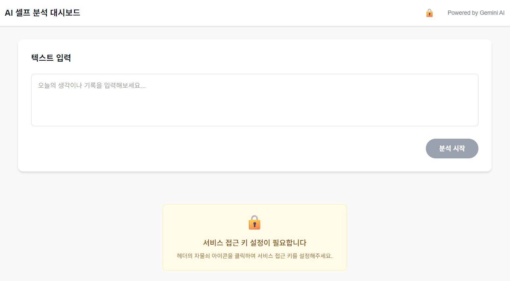
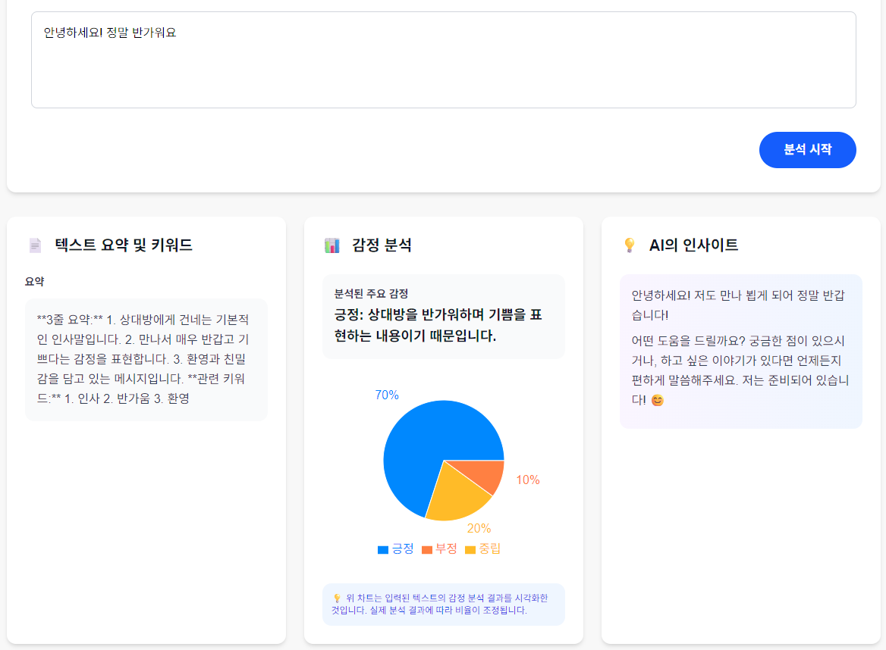
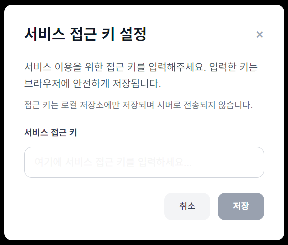

# AI 기반 셀프 분석 대시보드 (AI Self-Improvement Dashboard) - ✨ [바로가기](https://msa-self-dashboard-gemini.vercel.app)

## 🔒 메인화면


## ☁️ 결과화면


## 🔓 잠금 풀기


## 💿 환경변수 설정

### 필수 환경변수
```bash
# API 기본 URL
NEXT_PUBLIC_API_BASE_URL=https://msa-brain-gemini-173411279831.asia-northeast3.run.app
# 서비스 접근 키 (선택사항 - UI에서도 설정 가능)
NEXT_PUBLIC_API_KEY=액세스키는_GCP에배포된_도커컨테이너의_env에작성된_임의의키_입니다
```

### 선택적 환경변수 (커스텀 엔드포인트)
```bash
# API 엔드포인트 경로 (기본값이 제공되므로 선택사항)
NEXT_PUBLIC_SUMMARIZE_ENDPOINT=/gemini/summarize
NEXT_PUBLIC_SENTIMENT_ENDPOINT=/gemini/analyze_sentiment
NEXT_PUBLIC_GENERATE_ENDPOINT=/gemini/generate_response
```

---

이 프로젝트는 사용자가 텍스트 데이터를 입력하면, Gemini API를 활용하여 **텍스트 요약, 키워드 추출, 감정 분석**을 수행하고, 이를 시각적으로 보여주는 대시보드 형태의 웹 애플리케이션입니다.

## 기술 스택

- **프론트엔드**: Next.js (React), Tailwind CSS
- **데이터 시각화**: Recharts
- **API**: Gemini API
- **배포**: Vercel

## 시작하기

1. 의존성 설치:
   ```bash
   pnpm install
   ```

2. 환경 변수 설정:
   `.env.local` 파일에 Gemini API 키를 설정하세요.

3. 개발 서버 실행:
   ```bash
   pnpm dev
   ```

## 주요 기능

- 텍스트 요약 및 키워드 추출
- 감정 분석 및 시각화
- AI 응답 생성
- 반응형 대시보드 UI

## API 엔드포인트

- `POST /gemini/summarize` - 텍스트 요약 및 키워드 추출
- `POST /gemini/analyze_sentiment` - 감정 분석
- `POST /gemini/generate_response` - AI 응답 생성

## 배포

### Vercel 배포

1. 환경 변수 설정:
   ```
   NEXT_PUBLIC_API_BASE_URL=https://msa-brain-gemini-173411279831.asia-northeast3.run.app
   ```

2. 배포 명령어:
   ```bash
   vercel --prod
   ```

자세한 배포 가이드는 [VERCEL_DEPLOYMENT.md](./docs/VERCEL_DEPLOYMENT.md)를 참고하세요.

## 문제 해결

### 405 Method Not Allowed 오류
- Vercel 환경 변수가 제대로 설정되었는지 확인
- API URL에 `undefined`가 포함되지 않았는지 확인
